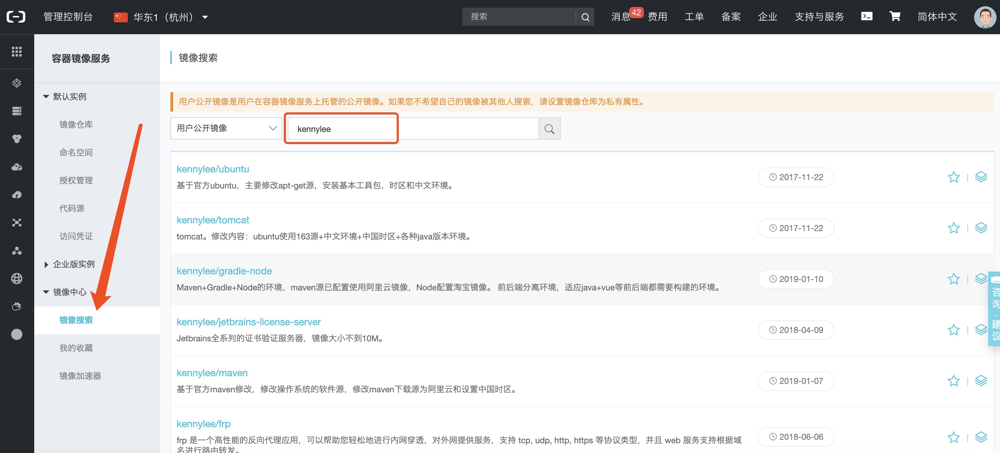

## 说明

存放各种docker image构建脚本或者快速启动的docker-compose文件。

实现：一处构建，处处可用，方便健忘人士和减轻国内开发人员的负担。

最后，我会在有空的时候尽量完善各个镜像的README，希望对大家有点帮助。

### 这个库的作用？

1. 存放由于种种原因，导致官方image不好使，需要自己构建的docker image。
2. 存放使用过的应用的快速启动文件docker-compose。
3. 由于想在国内快速下载某些镜像，所以使用第三方构建平台创建镜像构建仓库，构建平台需要代码仓库。

### 注意事项

_一些compose内都是设置data挂载到本目录的，方便实现数据分离，但这些数据是忽略提交的，所以使时需要注意新建目录和给予权限。_

## 关于应用的镜像下载

这个项目初衷是加速，所以其实很多应用的 *Dockerfile* 都已经在阿里云上构建好了，大家如果想使用的话并不需要再自己花时间去构建。

前阵子，大家可以直接在 https://dev.aliyun.com/search.html 进行镜像搜索。嗯，而现在？如果你已经点了前面这个地址的话，发现已经不像是一个镜像搜索的地方了，所以目前找得比较痛苦，但还是可以找到的，可以通过下面的方式（我就不再自己列出全部构建好的镜像甚至镜像版本了）。

1. 登录 https://cr.console.aliyun.com
2. 添加 镜像中心 → 镜像搜索
3. 在右侧【用户公开镜像】的输入框内输入 kennylee 就会列出目前我目前已经公开的镜像列表，包括镜像版本也可以看到。

示意图参考下面:

